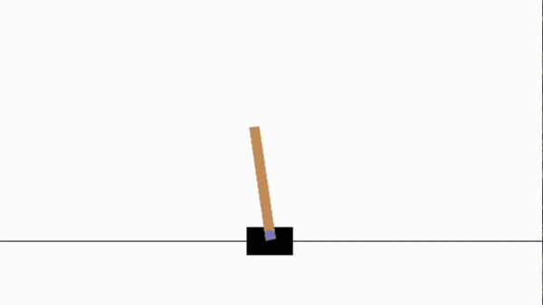
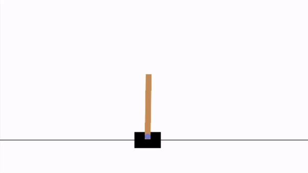

+++
title = 'Cartpole Problem'
date = 2024-06-21T16:01:00-07:00
draft = false
tags = ['article']
+++



## Introduction to the problem

The cartpole problem involves a movable cart on a track with a pole attached to its center. The only actions the agent can perform are to move the cart a step to the left, or a step to the right. The agent can fully observe the state of the environment at any given time step. The pole on the cart can rotate freely and is weighed down by gravity.

>An environment for this problem is generously available in the OpenAI Gym library through the CartPole-v1 environment. This library provides all the necessary tools to set up the problem and interact with the environment, allowing us to focus on a solution of the problem instead of the details of the environment. It also allows us to visualize the cartpole, and easily observe how the actions of the agent affect the positions of the cart and pole.

*Demo of the problem with the agent taking random actions*



## The Goal

**The goal of the problem is to get the agent to keep the pole on the cart upright**. To do so, the agent needs to move the cart to the left or right just the right amount at each time step such that the movement of the cart balances the movement of the pole against gravity.

## What can the agent observe?

The agent can observe the **cart position** on the x-axis, the **cart velocity**, the **pole angle** in radians, and the **pole angular velocity**.

## Approach

### Q-Learning

For the agent to know what upright is, it must be given rewards for achieving the required state and be penalized for not achieving the required state. In the cartpole environment, the agent gains a +1 reward for every step it take where the pole is maintained upright, and no reward if the pole fails to be upright. By encouraging the agent to take actions that maximize rewards, we can encourage actions that keep the pole upright.

To teach the agent to keep the pole upright, we can use Q-Learning utilizing Bellmans' equations. Q-Learning is an algorithm that learns from the environment by updating the Q-Values of the state-action pairs. By repeatedly training the agent on the same environment, the agent can take actions and then observe the outcome of the action and the reward it obtains from said action. We can use this to build a state-action pair table with values that correspond to the probability of maximizing rewards based on the action taken.

> **Bellman's Optimality Equation for Q-values**
$$
 Q[s_t, a_t] = r[s_t, a_t] + \gamma \max_a Q[s_{t+1}, a]
$$

> **Q-Learning Algorithm to update Q-values for state-action pairs**
$$
 Q[s, a] \leftarrow Q[s,a] + \alpha((r + \gamma \max_{a'}Q[s',a']) - Q[s,a])
$$

#### Gamma
- Gamma (\\(\gamma\\)) is the *discount factor*, and it influences how future rewards are valued immediate to current rewards. It is bounded between 0 and 1.
  - A value of 0 represents valuing only immediate rewards with no concern for future rewards.
  - A value of 1 represents valuing future rewards equally as much as immediate rewards.

#### Alpha
- Alpha (\\(\alpha\\)) is the *learning rate*, and it influences the extent to which the new information overrides the information learned in earlier iterations. It is bounded between 0 and 1.
  - With an (\\(\alpha\\)) closer to 1, the agent learns quicker because it heavily weighs new information. However, it can lead to instability as the agent may overly adjust to recent experiences.
  - With an (\\(\alpha\\)) closer to 0, the agent learns slowly as it relies more on the existing Q-values. This can lead to more stable learning but may also cause the agent to take a long time to adapt to changes in the environment.
  - For this problem we will run 2 versions of Q-learning: one with alpha set to a constant 0.1, and another with a decaying alpha where alpha is set to 1/k where k is the number of times an (s, a) pair has been seen.


### Epsilon Greedy Policy

Q-learning can create a state-action pair table, but does not tell the agent what action to take at what state.

To be able to exploit this data, we can use an epsilon-greedy policy. We want the agent to take more random steps at the beginning of training as it encourages exploration, allowing the agent to explore all possible actions and paths that may lead to the highest overall rewards rather than pigeonholing it into one series of actions. However, with enough iterations and enough exploration, we would like the agent to get greedier and take more action where the Q-value is higher so it gets better at refining the optimal series of actions for maximum rewards.

With the epsilon-greedy policy, we define a parameter (\\(\epsilon\\)) that determines the chance of taking a random action. The agent selects the greedy action with probability 1 - (\\(\epsilon\\)), and selects a random action otherwise. The greedy action is the action that maximizes the Q-value. We can start with a high epislon value to encourage the agent to explore. By decreasing the value of epsilon over time, we can get the agent to exploit instead of explore.

> **Epsilon-Greedy Policy**
> ``` python3
> x = random(0, 1)
> 
> if x < epsilon:
>     do random action
> else:
>     do greedy action [argmax(Q(s,a) for the given state)]
> ```


## Results

With both an alpha value of 0.1 and a decaying alpha, the Q-learning algorithm was run for 20000 episodes with 5000 steps per episode. With both versions of the Q-learning algorithm, the agent was able to learn the optimal policy for the cartpole problem. A demo of the agent taking the optimal actions is shown below.

